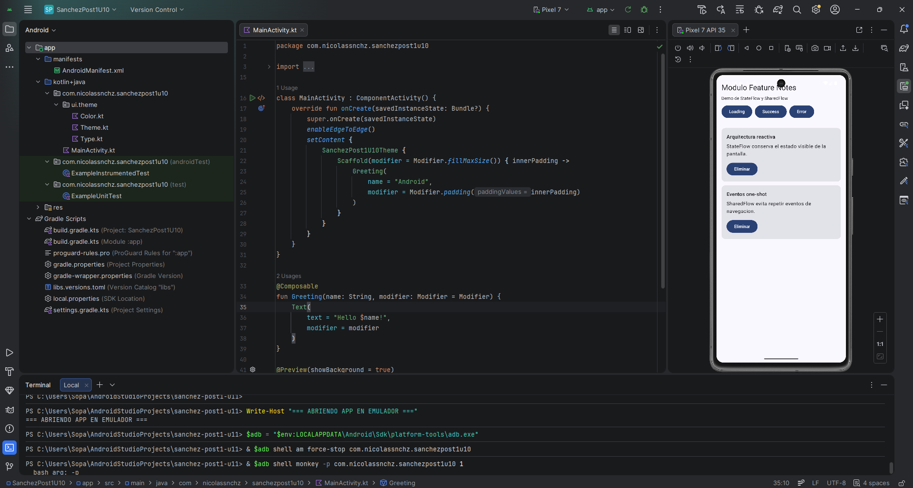
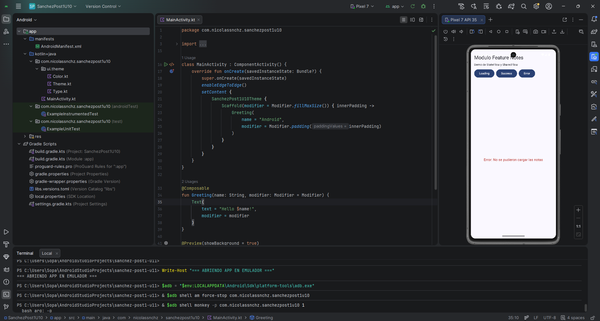

# sanchez-post1-u11

Proyecto Android para la actividad Unidad 11 - Post Contenido 1: Integracion Avanzada y Patrones Arquitectonicos.

## Objetivo

Implementar un modulo feature independiente en una aplicacion Android multi-modulo usando arquitectura reactiva.

El proyecto usa:

- Modulo :core:domain para entidades y contratos.
- Modulo :feature:notes para la funcionalidad de notas.
- StateFlow para representar el estado de UI.
- SharedFlow para eventos one-shot de navegacion.
- Jetpack Compose para mostrar Loading, Success y Error.

## Estructura del proyecto

- app: aplicacion principal.
- core/domain: entidad Note y contrato NoteRepository.
- feature/notes: pantalla, ViewModel, estados y eventos de notas.

## Modulos implementados

### :core:domain

Contiene la entidad Note y la interfaz NoteRepository. El modulo feature depende de esta abstraccion y no de una implementacion concreta.

Archivos principales:

- core/domain/src/main/java/com/nicolassnchz/sanchezpost1u11/domain/model/Note.kt
- core/domain/src/main/java/com/nicolassnchz/sanchezpost1u11/domain/repository/NoteRepository.kt

### :feature:notes

Contiene la funcionalidad independiente de notas.

Archivos principales:

- feature/notes/src/main/java/com/nicolassnchz/sanchezpost1u11/feature/notes/NotesViewModel.kt
- feature/notes/src/main/java/com/nicolassnchz/sanchezpost1u11/feature/notes/NotesScreen.kt
- feature/notes/src/main/java/com/nicolassnchz/sanchezpost1u11/feature/notes/FakeNoteRepository.kt

## Arquitectura reactiva

NotesViewModel expone el estado de la pantalla mediante StateFlow:

- Loading: muestra indicador de carga.
- Success: muestra la lista de notas.
- Error: muestra mensaje de error.

Los eventos de navegacion y acciones one-shot se manejan con SharedFlow:

- NavigateToDetail
- NoteDeleted

## Comandos de verificacion

.\gradlew.bat :feature:notes:assembleDebug

.\gradlew.bat :app:assembleDebug

## Evidencias de estados de UI

### Estado Success

La pantalla muestra correctamente la lista de notas cargadas.

### Estado Loading

La pantalla muestra el indicador de carga usando el estado Loading.

### Estado Error

La pantalla muestra un mensaje de error controlado.

## Decisiones de diseno

- Se separo el contrato de dominio de la implementacion visual.
- El feature de notas puede compilar de forma independiente.
- StateFlow mantiene el ultimo estado visible de la UI.
- SharedFlow evita repetir eventos one-shot.
- La app principal solo integra el feature para demostrar los tres estados requeridos.

## Resultado

El proyecto contiene codigo fuente funcional, modulo feature verificable, capturas de los estados de UI y commits descriptivos.
